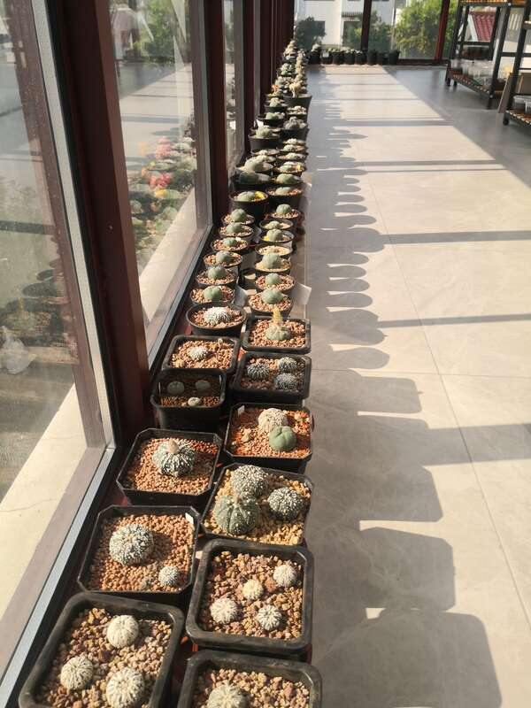
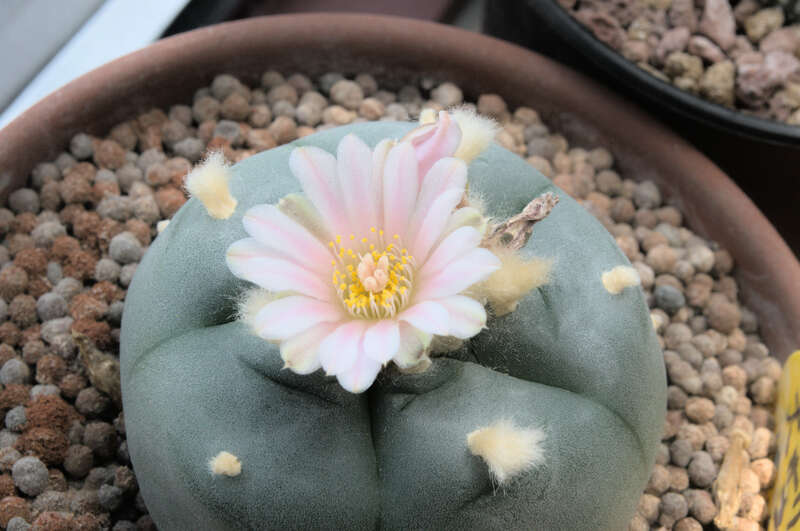
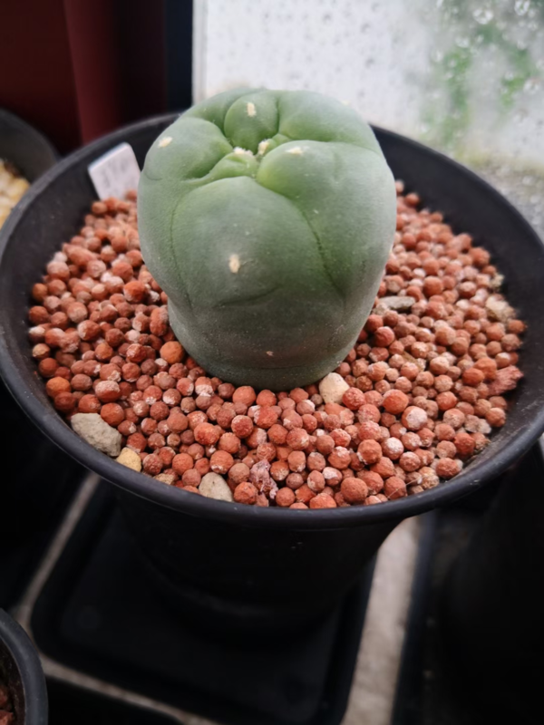
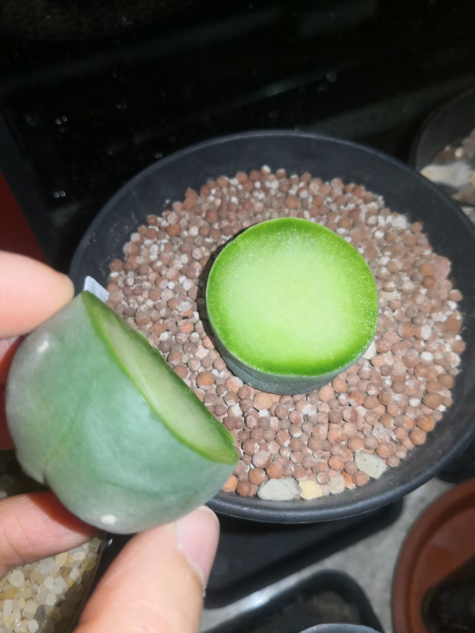
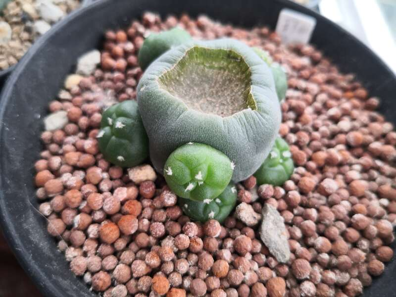
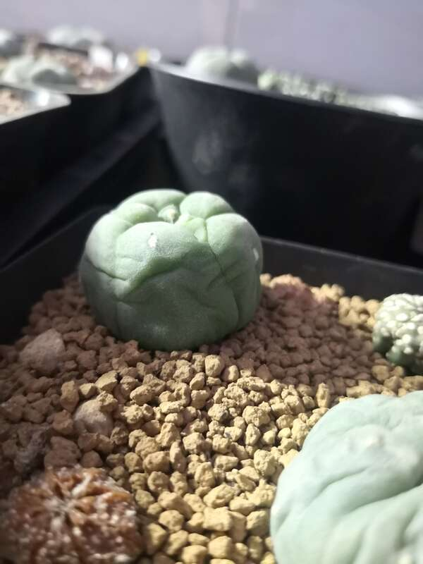

我的种植环境在阳台，

比不上阳光房的光照,更别提跟大棚的环境比：
虽然我已经尽可能的给他们阳光位，但还是显得不够，
而在光照不足的情况下，哪怕是不用强光照的无刺球，也会有徒长的风险，
如果配土时，泥炭多了点，
或者，手欠，浇水再频繁了点，
一个胖乎乎，丑萌丑萌的鱼宝宝，

就会长成一个圆柱体。

再好的品种，如果没有一个好的状态，最后，哪怕你说它是实生，也是毁了。

起初，砍头，我下不去手，
每一棵自己一手带起来的植物，我都不忍心伤害它分豪，
只想通过换盆，换土，增加颗粒的比例，增加大颗粒的比例，
但这个时间太过漫长，没有一年，两年，应该是看不到效果的。
于是，为了实验，最终我还是狠下心来，砍了一个艳肌大疣翠，一个肋骨乌。
当然在砍他们的时候，我是一边在默念：我砍你是为了救你，砍你，是为了救你，来减少实则上对他们腰斩的罪恶感。

2022年3月25日，大疣翠去年移的苗，老盆砍了头，
肋骨乌一周前修了根移了苗，石食无有机质，也被砍了头，
下半截留着没动，头盖骨晾了一个月
两个月后，来看一下，

大疣翠已开始群生，

头盖骨也已生根，一个变两，

肋骨乌，目前装死中，但我宁愿相信每一个表面装死的球，都在偷偷的扎根。
现在的样子，是不是比没砍头前更可爱一些？

期待三个月后，半年，一年后的变化，待后续分享。
