我开始玩仙人球，是受了花的吸引。

我开始玩播种，是源自于我贪心，

喜欢每一款球，然后还想拥有更多，

但钱不够，当然，并不是我的经济真的不允许， 

只是我所给自己规划的零花钱不够，毕竟，不能因为一个兴趣而影响到生活本身。

节制是一个成年人该有的态度。那么既然不能投入金钱，我就投入时间。

言归正传，**播种简单概括，分三步：配土，消毒，选种。**

我的配土，唯一要求：**全部用新土**。 我的消毒：准备**多菌灵或百菌清或高锰酸钾，此三种，有什么用什么**。

我的选种：找自己熟悉的花友持续购买所需要的种子。

第一步：我们先来配土，把你手里所有的1－3MM的颗粒，各来一份。如果手上没有，那么按我的来配：赤玉，轻石，火山岩，鹿沼，仙土，稻壳炭，各一勺，再来一勺半泥炭。**（颗粒品种没有这么多，可以用现有的颗粒增加数量，但必须是全新的土）**

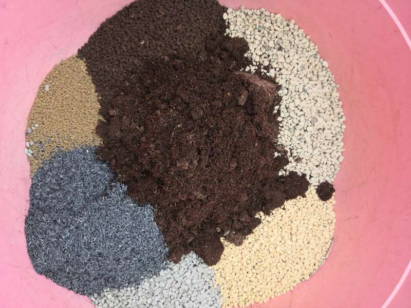

拌匀，这时候的泥炭颗粒配比，大约是3：7

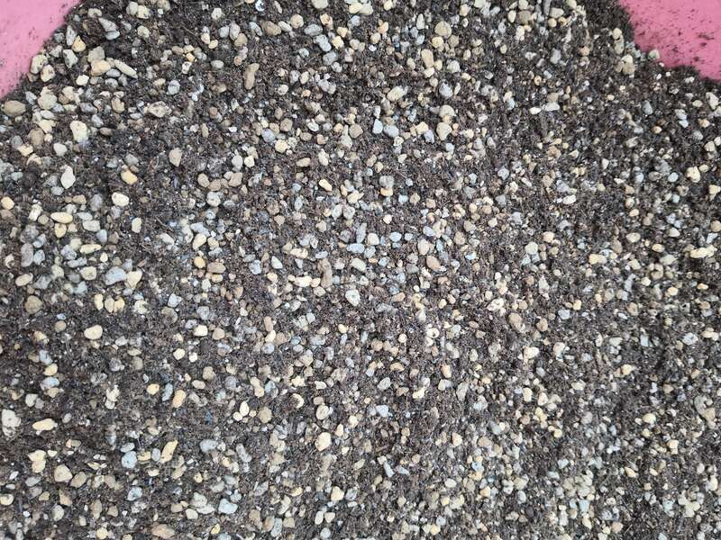

第二步，准备一个干净的塑料打包盒，**（我是买全新的，如果你播的少，可以把平时的外卖打包盒洗干净收集起来）**底部打上孔，用电铬铁或是小铁丝烧红。

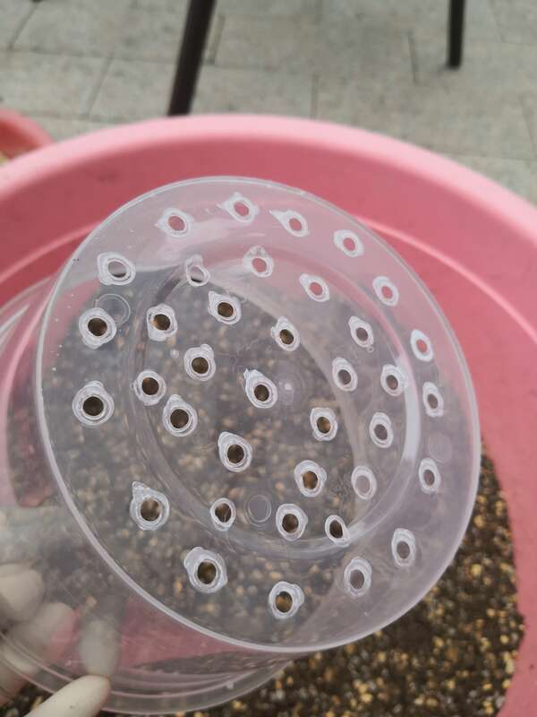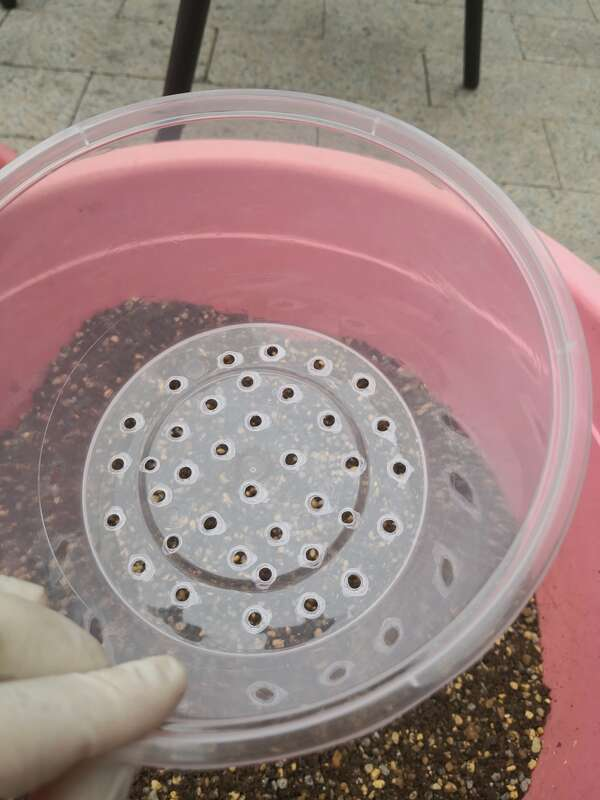

第三步，用6－9的颗粒，填上盆底石

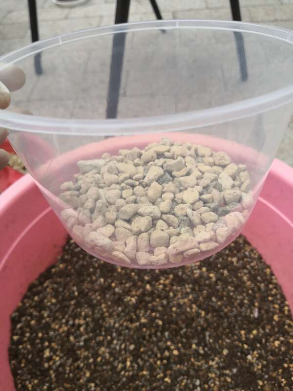

第四步：加入拌好的土

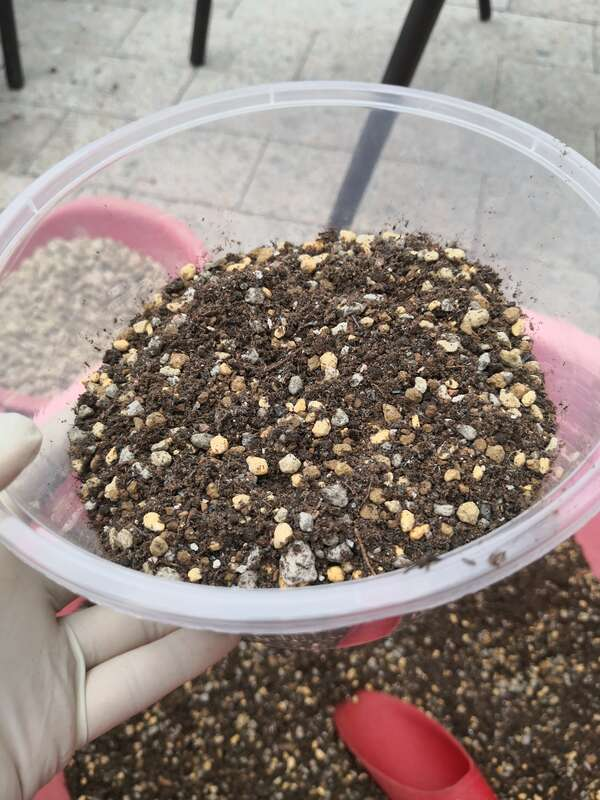

约占打包盒的1／2即可

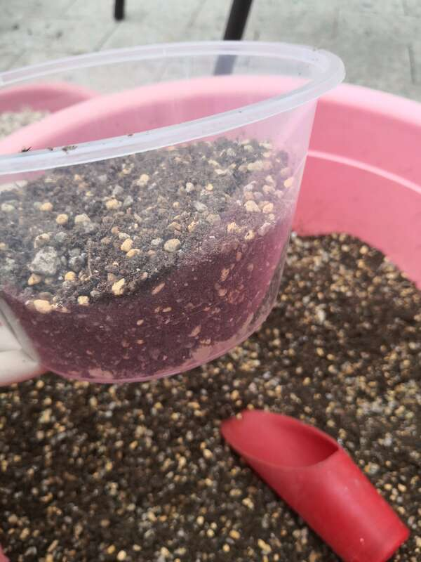

买园艺资材时，带上这样一个勺子，2勺半。

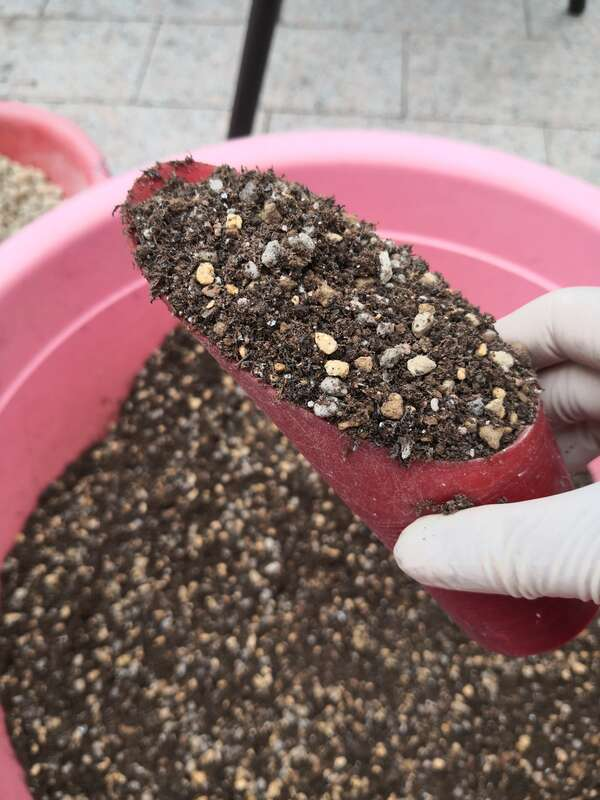

第五步，将土稍稍的抹平整，上部均匀洒上一层1－3MM的赤玉土

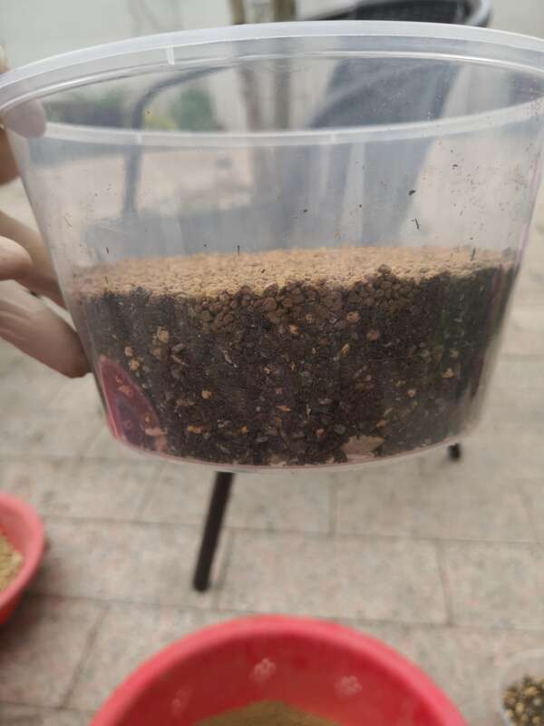

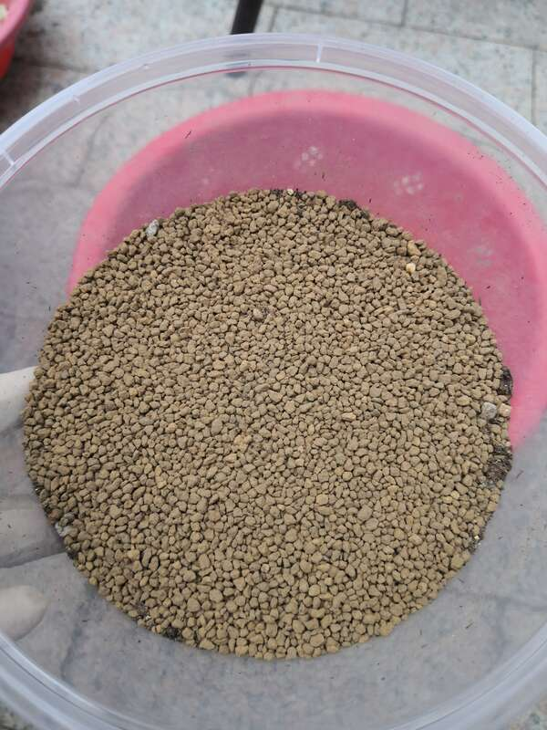

压实每一个角落，**这一步很重要，不压实后续土和盆将会产生分离，每次浇水搬动时，会晃动到小苗的根系，不利生长。**

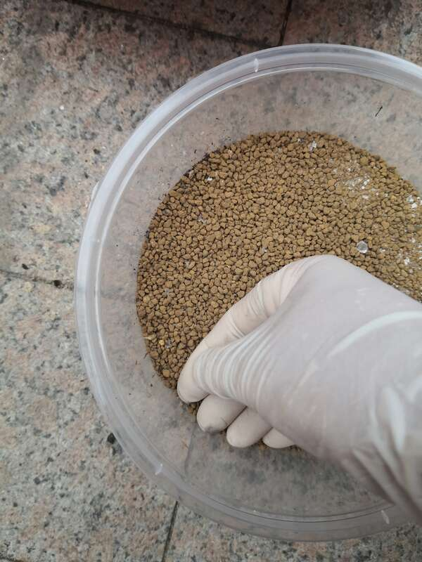

配土完成后，那么接下来我们准备药剂。我手上目前有多菌灵和百菌清，本次买到的百菌清是蓝色的，不喜欢用，高锰酸钾每次用完会沾了一手的黄色素，也不喜欢用，所以，本次我是用了多菌灵。

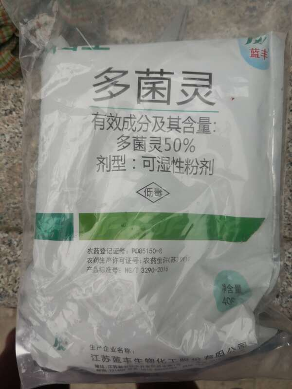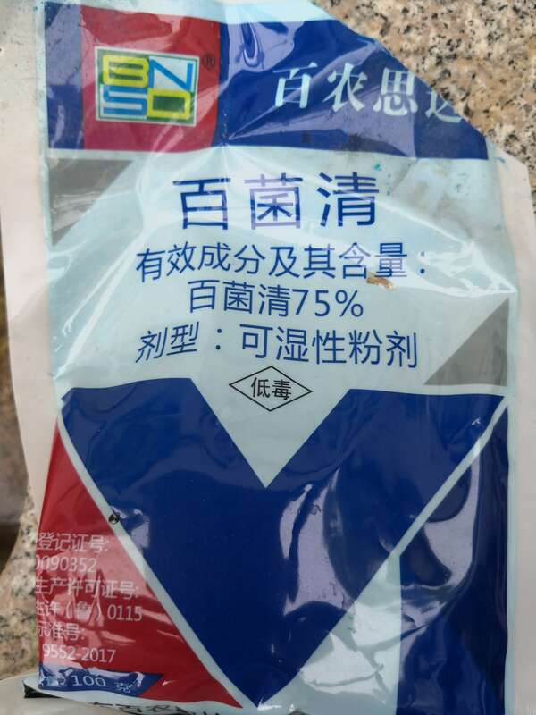

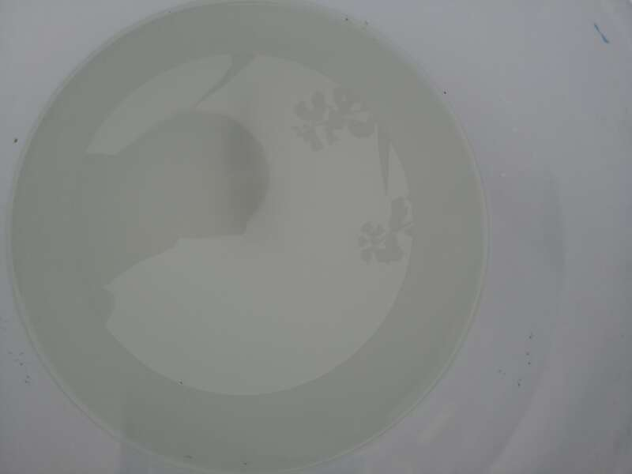

把配好的盆土放入容器中

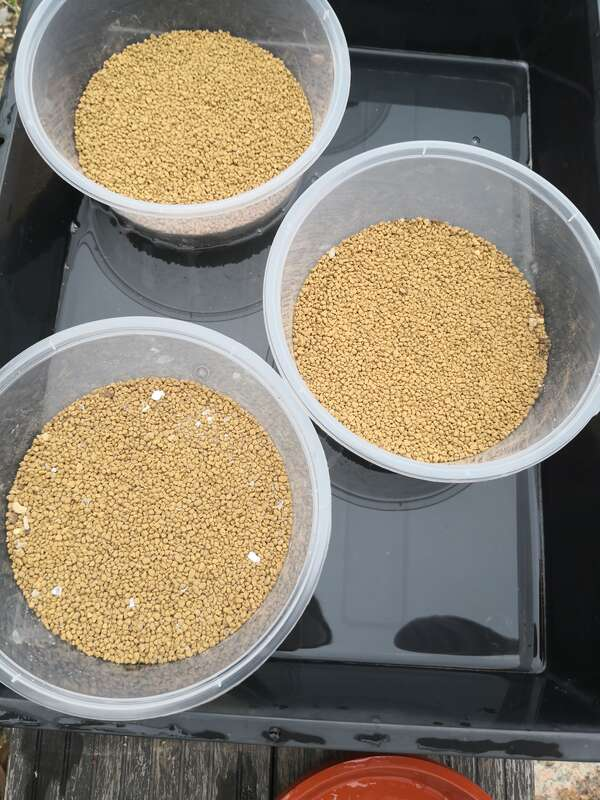

浸透到如下湿度

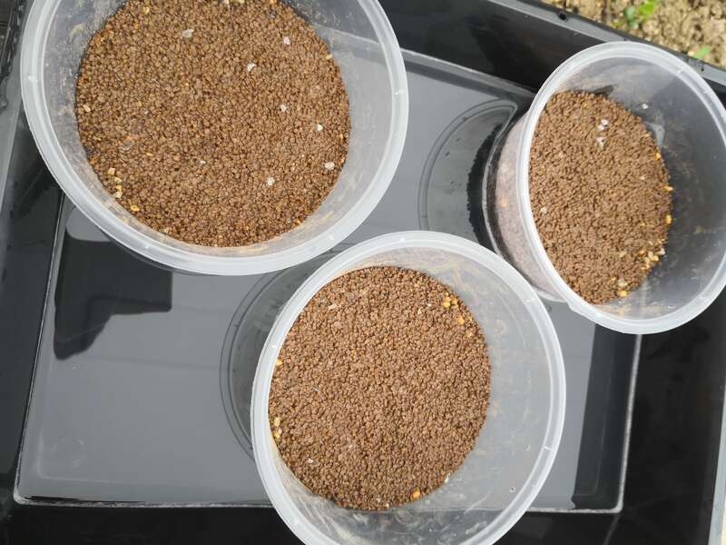

盆，土，消毒全部到位后，现在开始准备播种

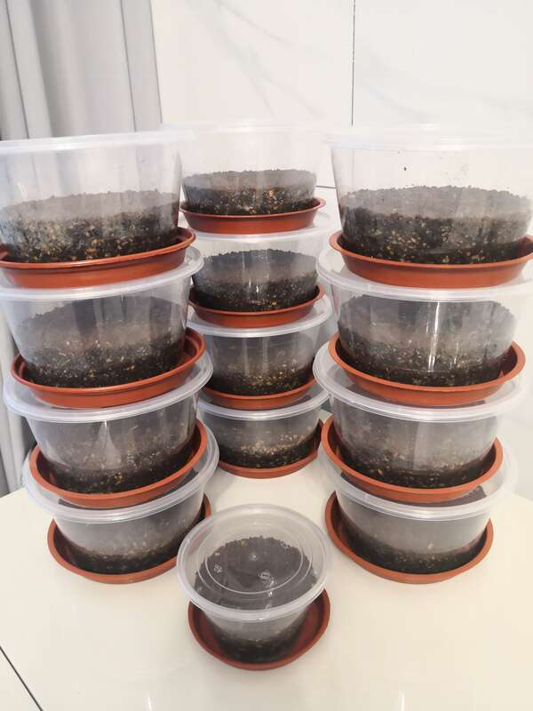

准备好标签，笔，**这一步千万不要省略，仙人球成长的过程相对漫长，不做标记，会让你最后都不知道自己播了些什么。**

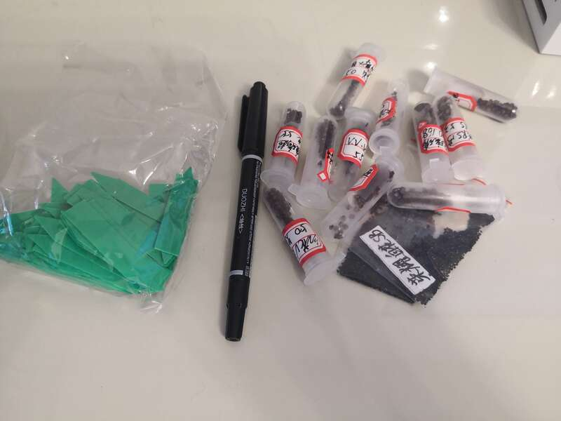

然后，种子，自然，你喜欢什么便播什么吧，此处自由发挥。

我播的兜，种子相对比较大，可以徒手点播。种子如彩草样大小的，想要点播，就得借助牙签，想省事的，当然也可以随便洒洒。

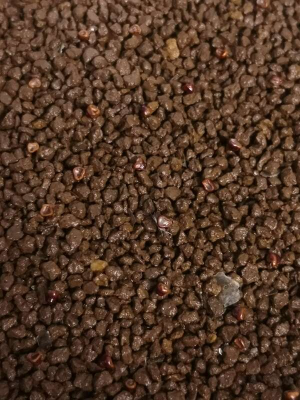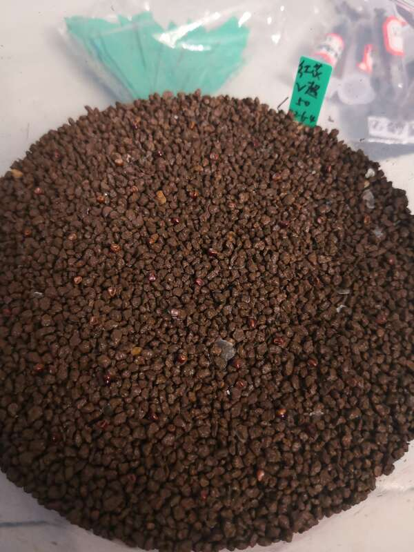

关上盖子，**此处注意，种子千万不能覆土。**放在温暖散光处，仙人球种子的发芽适合温度：摄氏25－35度，发芽时长3－7天。

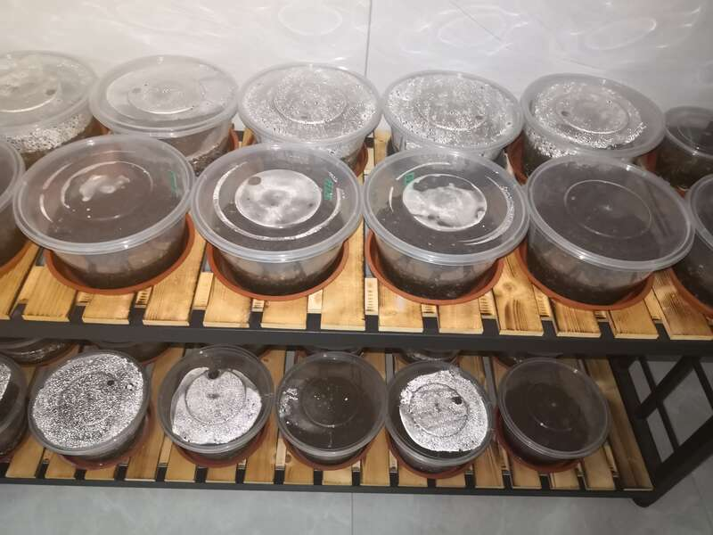

接下来，是一个漫长且煎熬的一周。
