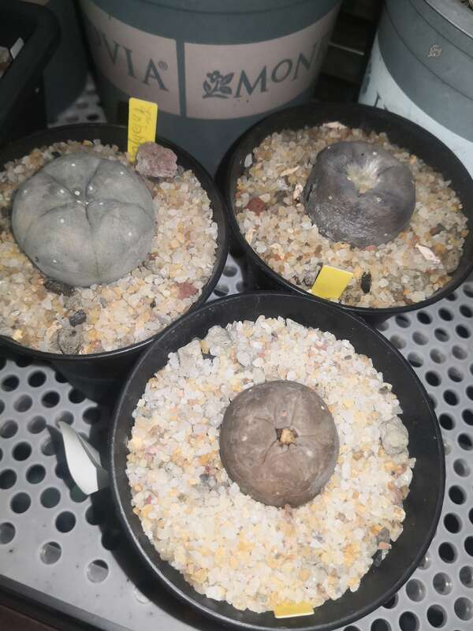
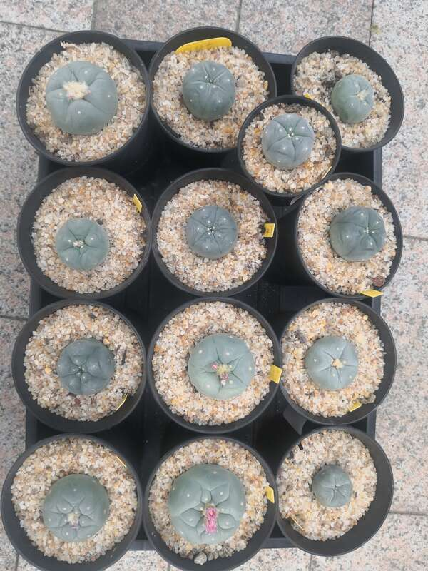
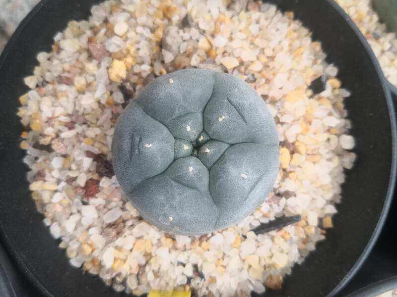
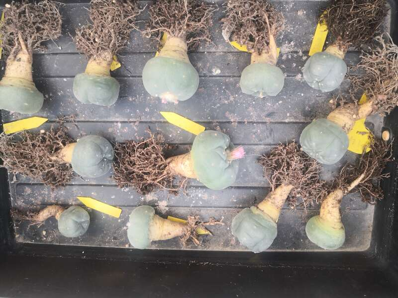
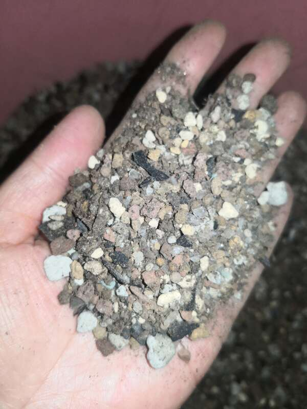
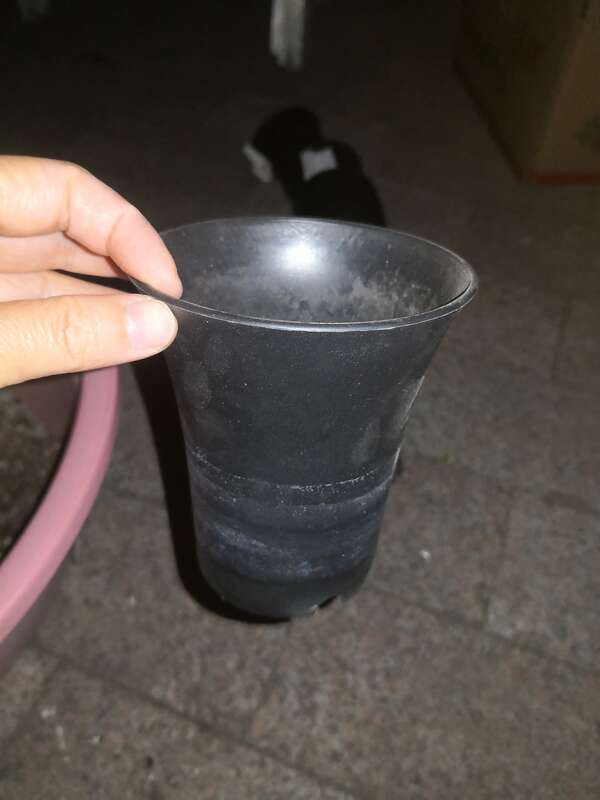
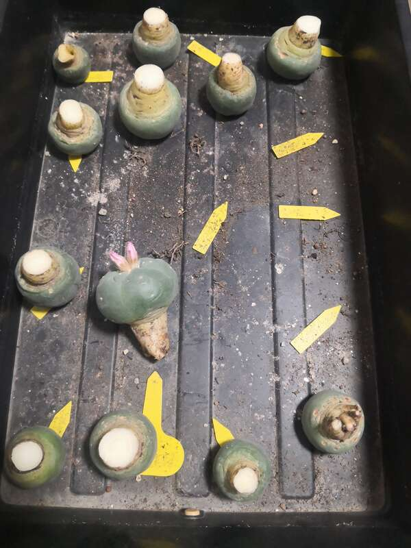

写今天这篇博文，心情有点沉重。连续两天，烂了四个5CM的鱼，昨天还好好的开着花，今天说烂就烂了

不心疼，那是假的。看这几盆，都是细沙铺面，不透气？闷了？今天一早起床，把这一批的所有苗子都集中起来，不管是倒铺面，还是倒盆，总要做点什么，及时止损。

那么，接下来我需要好好想一想，到底是为什么会这样烂的措手不及。死于闷，那是肯定的。

铺面不透气，是其一

看根系，泥炭有点多

看土，缺大颗粒

看盆，是万象，较深

综合以上，得出其二：泥炭多了，缺大颗粒，盆深。

球大后未换盆是首因，球越大，泥炭需要越少，颗粒需要越大。

全部倒盆修根，经验都是死出来的，擦干眼泪再来。

​    
